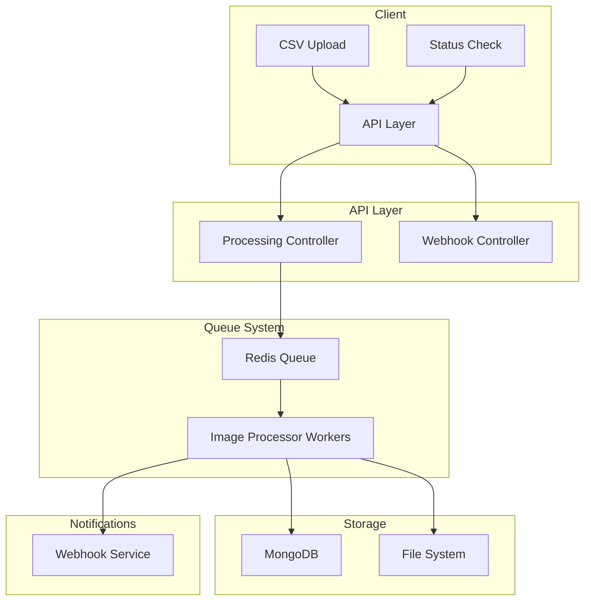

# Image Processing System - Low Level Design

## System Overview
This system provides a scalable, asynchronous image processing service that handles CSV-based batch image processing requests with parallel execution capabilities.

## Architecture Diagram


## Component Details

### 1. API Layer
- **Routes (`processingRoutes.ts`)**
  - `/upload`: Handles CSV file upload
  - `/status/:requestId`: Returns processing status
  - `/webhook`: Receives processing completion notifications
- **Controllers**
  - `ProcessingController`: Manages CSV parsing and job creation
  - `WebhookController`: Handles completion notifications

### 2. Queue System
- **Redis Queue**
  - Uses Bull queue for reliable job processing
  - Enables parallel processing of images
  - Handles job retries and failure scenarios
- **Image Processor**
  - Processes multiple images concurrently
  - Implements compression using Sharp library
  - Tracks progress per image and overall status

### 3. Storage Layer
- **MongoDB**
  - Stores processing requests and their status
  - Tracks individual image processing status
  - Schema includes request details and product information
- **File System**
  - Stores processed images in uploads directory
  - Organizes files by request ID and sequence

### 4. Notification System
- **Webhook Service**
  - Notifies when batch processing completes
  - Provides detailed completion statistics
  - Includes product and image processing details

## Data Flow

1. **CSV Upload Flow**
   ```
   Client -> Upload Endpoint -> CSV Parser -> Job Queue -> Status Response
   ```

2. **Processing Flow**
   ```
   Queue -> Worker -> Download -> Compress -> Save -> Update Status -> Webhook
   ```

3. **Status Check Flow**
   ```
   Client -> Status Endpoint -> MongoDB -> Status Response
   ```

## Technical Specifications

### API Endpoints

1. **POST /api/upload**
   - Accepts multipart/form-data with CSV file
   - Returns requestId for tracking
   ```typescript
   Response {
     requestId: string
     status: ProcessingStatus
     totalImages: number
   }
   ```

2. **GET /api/status/:requestId**
   - Returns current processing status
   ```typescript
   Response {
     status: ProcessingStatus
     processedImages: number
     totalImages: number
     products: Product[]
   }
   ```

3. **POST /api/webhook**
   - Receives processing completion notifications
   ```typescript
   Request {
     requestId: string
     status: ProcessingStatus
     totalImages: number
     processedImages: number
     products: Product[]
   }
   ```

### Core Components

1. **Image Processing Service**
   - Compression: JPEG quality 50%
   - Parallel processing: 5 concurrent jobs
   - Automatic retries on failure
   - Progress tracking per image

2. **Queue Configuration**
   ```typescript
   {
     attempts: 3,
     backoff: {
       type: 'exponential',
       delay: 2000
     },
     removeOnComplete: true
   }
   ```

3. **MongoDB Schema**
   ```typescript
   ProcessingRequest {
     requestId: string
     status: ProcessingStatus
     totalImages: number
     processedImages: number
     products: {
       serialNumber: string
       productName: string
       inputImageUrls: string[]
       outputImageUrls: string[]
     }[]
   }
   ```

## Performance Considerations

1. **Parallel Processing**
   - Multiple worker processes for concurrent image processing
   - Redis-based job queue for reliable distribution
   - Configurable concurrency levels

2. **Resource Management**
   - Automatic cleanup of completed jobs
   - Temporary file management
   - Memory-efficient streaming for large files

3. **Error Handling**
   - Automatic retries for failed jobs
   - Detailed error logging
   - Graceful degradation

## Security Considerations

1. **Input Validation**
   - CSV format validation
   - Image URL validation
   - File size limits

2. **Resource Access**
   - Secure file system operations
   - Database access controls
   - Rate limiting on API endpoints

## Monitoring and Logging

1. **Processing Logs**
   - Job start/completion times
   - Processing duration per image
   - Error details and stack traces

2. **Webhook Notifications**
   - Processing completion status
   - Detailed success/failure metrics
   - Product-level processing results

## Future Enhancements

1. **Scalability**
   - Horizontal scaling of worker processes
   - Distributed processing across multiple nodes
   - Cloud storage integration

2. **Features**
   - Additional image processing options
   - Real-time progress updates
   - User authentication and authorization
   - Custom webhook configurations
